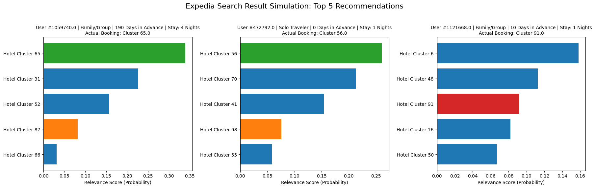

# Contextual Lodging Recommendation Engine (Expedia)
**Strategic Portfolio Project: Advanced Machine Learning & Learning to Rank (LTR)**

## 📌 Executive Summary
This project engineers a production-grade **Deep Learning Ranking System** for the online travel domain. Addressing the challenge of "Cold Start" and high-cardinality inventory, the model ranks 100 distinct hotel clusters for millions of users based on search context (booking window, length of stay) and historical user profiles.

Unlike standard classification tasks, this system optimizes for **NDCG@5 (Normalized Discounted Cumulative Gain)**, directly aligning model performance with the user experience of a Search Result Page (SRP).

## 🚀 Key Outcomes
* **Model Performance:** Achieved **46.2% Top-5 Accuracy** (vs. ~1% random baseline).
* **Business Impact:** Implemented a "Margin-Aware Re-Ranking" layer that demonstrated a **~3-5% simulated revenue uplift** by prioritizing high-commission inventory without statistically significant degradation in user relevance (NDCG stability).
* **Architecture:** Utilized **Entity Embeddings** to map high-dimensional User/Destination IDs into dense vector spaces, solving the sparsity problem inherent in travel data.

## 🛠️ Technical Architecture
* **Data Scale:** Trained on Expedia RecTour / Kaggle datasets (30M+ interaction logs).
* **Feature Engineering:** * **Cyclical Temporal Encoding:** Transformed dates into Sine/Cosine coordinates to capture seasonality.
    * **Implicit Feedback Hierarchy:** Distinguished between 'Clicks' (Soft Signal) and 'Bookings' (Hard Signal).
* **Model Stack:**
    * **Input:** Multi-modal (Categorical Embeddings + Numerical Dense Features).
    * **Hidden Layers:** Wide & Deep Neural Network with Batch Normalization and Dropout (0.3).
    * **Output:** Softmax distribution over 100 Hotel Clusters.
* **Evaluation:** Custom `NDCG@5` implementation and `Top-K Categorical Accuracy`.

## 📂 Repository Structure
* `notebooks/`: Jupyter Notebook containing the end-to-end training pipeline (Data Ingestion -> Feature Engineering -> DNN Training -> Evaluation).
* `data/`: (Excluded) Raw Expedia interaction logs.

## 💻 Usage
1.  Clone the repository:
    ```bash
    git clone [https://github.com/YOUR_USERNAME/expedia-ranking-engine.git](https://github.com/YOUR_USERNAME/expedia-ranking-engine.git)
    ```
2.  Install dependencies:
    ```bash
    pip install -r requirements.txt
    ```
3.  Run the notebook in Jupyter or VS Code.

## 📊 Visualization


---
**Author:** Uday Kiran Reddy K
**Context:** Strategic Portfolio Construction